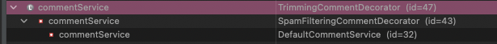
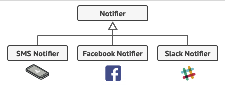
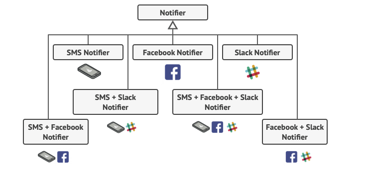
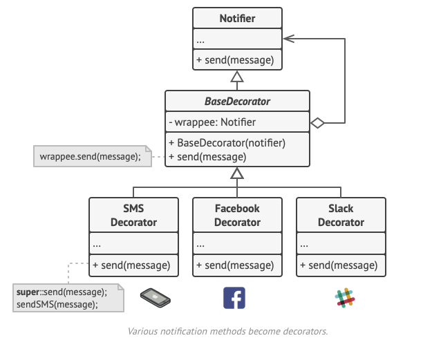

# decorator-prototype
Decorator pattern prototype Coding

## 데코레이터 패턴
- 기존에있는 코드를 건드리지 않고 부가적인 기능을 추가할 수 있는 구조적인 패턴
- 런타임에 부가기능을 추가할 수 있다?
- 상속을 쓰면 의존성이 정해져버리기 때문에, 위임을 사용해서 유연하게 부가 기능을 추가할 수 있게한다.
- Decorator(Wrapper)를 이용해 decorator들을 감싸서 해결한다.
- 구현방법
    - commentService를 인터페이스로 만들고 그 서비스가 하는 일이 있을 경우 그 일은 defaultCommentService로 들어가게 된다.
    - 데코레이터
        - 데코레이터를 만들어 주는데 데코레이터는 commentService의 구현체이다.
        - 데코레이터는 CommentService를 필드고 갖고 있는다.
        - trimming, spamFilter 두가지의 데코레이터를 만들고 두 데코레이터를 적용한 객체를 생성하면 아래와 같은 모양이 만들어진다.
            
    
## 적용 방안
- 현재 이메일만 전송하는 모듈이지만 추후 다른 알림이 필요해질 수 있다.

    
  
- 다른 알림들을 유동적으로 사용할 경우 아래처럼 지저분한 방식의 구조가 될 수 있다.

    
  
- 단순 상속이 아닌 데코레이터를 적용해서 확장이 편리한 모듈을 만들 수 있다.

    
